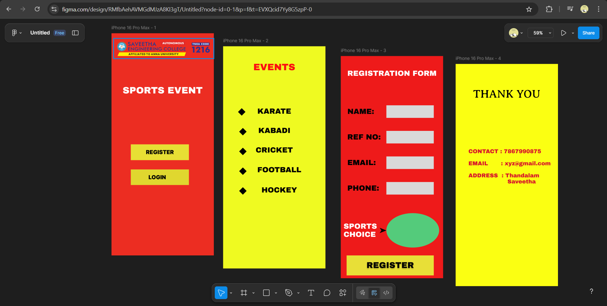

# Ex09 Event Registration Web Application
## Date:09.11.2025

## AIM:
To design, develop and deploy a web application for event registration.

## DESIGN STEPS:

### Step 1:
Create a new frame.

### Step 2:
Select any one preset size of your choice.

### Step 3:
Select the shapes you need.

### Step 4:
Import images as needed.

### Step 5:
Create pages based on your need and link them.

### Step 6:

Validate the HTML and CSS code.

### Step 6:

Publish the website in the given URL.

## DESIGN TOOL:
Figma

## CODE:
```
Home page

<!DOCTYPE html>
<html lang="en">
<head>
  <meta charset="UTF-8">
  <meta name="viewport" content="width=device-width, initial-scale=1.0">
  <title>Register / Login</title>
  <link rel="stylesheet" href="register.css">
</head>
<body>
  <div class="register-container">
    
    <h1>SPORTS EVENT</h1>

    <button class="btn register-btn">REGISTER</button>
    <button class="btn login-btn">LOGIN</button>
  </div>
</body>
</html>

CSS:

.Seclogo01as1 {
  width: 431px;
  height: 87px;
  left: 9px;
  top: 22px;
  position: absolute;
}


.Rectangle1 {
  width: 250px;
  height: 68px;
  left: 83px;
  top: 478px;
  position: absolute;
  background: linear-gradient(
    0deg,
    rgba(236, 225, 17, 0.81) 0%,
    rgba(236, 225, 17, 0.81) 100%
  ),
  rgba(129, 110, 17, 0.07),
  #d9d9d9;
}

.Registerspan {
  color: rgba(0, 0, 0, 0.2);
  font-size: 24px;
  font-family: "Inter", sans-serif;
  font-weight: 900;
}

Page2

<!DOCTYPE html>
<html lang="en">
<head>
  <meta charset="UTF-8" />
  <meta name="viewport" content="width=device-width, initial-scale=1.0" />
  <title>Events</title>
  <link rel="stylesheet" href="events.css" />
</head>
<body>
  <div class="events-container">
    <h1>EVENTS</h1>
    <ul class="event-list">
      <li>◆ KARATE</li>
      <li>◆ KABADI</li>
      <li>◆ CRICKET</li>
      <li>◆ FOOTBALL</li>
      <li>◆ HOCKEY</li>
    </ul>
  </div>
</body>
</html>

CSS:

body {
  margin: 0;
  font-family: 'Archivo Black', sans-serif;
  background: linear-gradient(0deg, rgba(238, 249, 25, 0.97) 0%, rgba(238, 249, 25, 0.97) 100%);
  display: flex;
  justify-content: center;
  align-items: center;
  height: 100vh;
}

.events-container {
  text-align: center;
  width: 440px;
  padding: 40px;
}

h1 {
  color: #FC1010;
  font-size: 40px;
  margin-bottom: 40px;
}

.event-list {
  list-style: none;
  padding: 0;
  margin: 0;
}

.event-list li {
  font-size: 32px;
  color: black;
  margin: 20px 0;
}

Page3

<!DOCTYPE html>
<html lang="en">
<head>
  <meta charset="UTF-8">
  <meta name="viewport" content="width=device-width, initial-scale=1.0">
  <title>Registration Form</title>
  <link rel="stylesheet" href="registration.css">
</head>
<body>
  <div class="form-container">
    <h1>REGISTRATION FORM</h1>

    <form>
      <label for="name">NAME:</label>
      <input type="text" id="name" name="name" required>

      <label for="refno">REF NO:</label>
      <input type="text" id="refno" name="refno" required>

      <label for="email">EMAIL:</label>
      <input type="email" id="email" name="email" required>

      <label for="phone">PHONE:</label>
      <input type="tel" id="phone" name="phone" required>

      <label for="sports">SPORTS CHOICE:</label>
      <select id="sports" name="sports" required>
        <option value="">Select Sport</option>
        <option>Cricket</option>
        <option>Football</option>
        <option>Kabadi</option>
        <option>Karate</option>
        <option>Hockey</option>
      </select>

      <button type="submit" class="register-btn">REGISTER ➤</button>
    </form>
  </div>
</body>
</html>

CSS: 

body {
  margin: 0;
  font-family: 'Archivo Black', sans-serif;
  background: linear-gradient(0deg, #EE1A1A 0%, #EE1A1A 100%);
  display: flex;
  justify-content: center;
  align-items: center;
  height: 100vh;
  color: white;
}

.form-container {
  width: 440px;
  padding: 40px 20px;
  text-align: center;
}

h1 {
  font-size: 32px;
  margin-bottom: 40px;
}

form {
  display: flex;
  flex-direction: column;
  gap: 25px;
  align-items: center;
}

label {
  font-size: 24px;
  color: white;
  text-align: left;
  width: 100%;
  max-width: 360px;
}

input,
select {
  width: 100%;
  max-width: 360px;
  height: 50px;
  border: none;
  border-radius: 6px;
  background: #d9d9d9;
  font-size: 18px;
  padding: 0 10px;
  outline: none;
}

select {
  background: linear-gradient(0deg, #54cb7b 0%, #54cb7b 100%);
  color: black;
  font-weight: 600;
}

.register-btn {
  width: 90%;
  max-width: 375px;
  height: 70px;
  margin-top: 30px;
  font-size: 32px;
  color: black;
  background: rgba(236, 225, 17, 0.81);
  border: none;
  border-radius: 8px;
  cursor: pointer;
  text-shadow: 0px 4px 5px rgba(0, 0, 0, 0.25);
  transition: 0.3s ease;
}

.register-btn:hover {
  transform: scale(1.05);
}

Page4

<div class="thankyou-container">
  <h1 class="thankyou-title">THANK YOU</h1>
  <div class="thankyou-details">
    CONTACT : 7867990875<br><br>
    EMAIL : xyz@gmail.com<br><br>
    ADDRESS : Thandalam<br>
    &nbsp;&nbsp;&nbsp;&nbsp;&nbsp;&nbsp;Saveetha
  </div>
</div>


CSS:

.thankyou-container {
  width: 440px;
  height: 956px;
  position: relative;
  background: linear-gradient(0deg, #FBFF12 0%, #FBFF12 100%), 
              rgba(236, 225, 17, 0.81), 
              white;
  overflow: hidden;
}

.thankyou-title {
  position: absolute;
  left: 75px;
  top: 100px;
  text-align: center;
  color: black;
  font-size: 48px;
  font-family: "Averia Serif Libre", serif;
  font-weight: 400;
}

.thankyou-details {
  position: absolute;
  left: 55px;
  top: 363px;
  color: #D7132A;
  font-size: 24px;
  font-family: "Archivo Black", sans-serif;
  font-weight: 400;
  line-height: 1.6;
}
```

## OUTPUT:



## RESULT:
The program to design, develop and deploy a web application for event registration is completed successfully.
